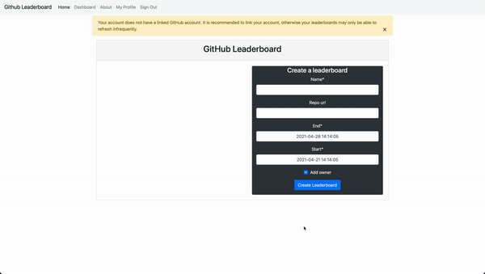
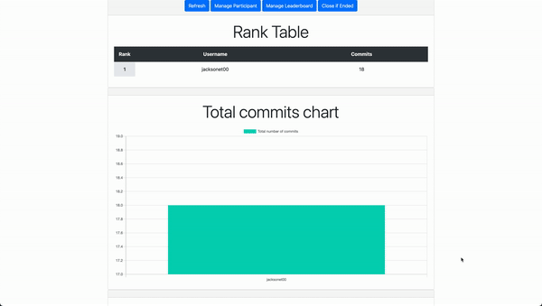

# Github Leaderboard

This Django website allows people to login with their Github accounts, pull commits from Github repos,
and rank users by the number of commits.

[Application is deployed at Heroku.](https://fierce-shore-14743.herokuapp.com/)

## Demo





## Developer Usage Documentation

[The project is setup with cookiecutter and docker so follow this link.](https://cookiecutter-django.readthedocs.io/en/latest/developing-locally-docker.html)
The following instructions is the bare minimal to get things running. Important configuration instructions is included
in the link.

Important locations are `config` which contains top level information about Django like routing for homepage and
installed apps. `requirements` contain the Python packages that Docker uses. `compose` is for
Docker. `github_leaderboard` contains all the Django files that you would modify.

### Setup pre-commit hooks

This runs pre-commit before you commit with flake8 and black autoformatting. If you have flake8 errors,
the code will fail to commit.

```bash
python -m venv .venv
source .venv/bin/activate
pip install pre-commit
pre-commit install
```

### Setup docker environment from our project dependencies

1. Build the docker containers

   ```bash
   docker-compose -f local.yml build
   ```

2. If in production, we can easily change things by running the production setting files.

   ```bash
   docker-compose -f production.yml build
   ```

### Add a new dependency to the project

1. Save the dependency to the requirements file. Note we have two different files `local.txt` and `production.txt` for
   the two environments. Remember to add the right dependency to the right file

   ```bash
   # Local dependency
   echo "<DEPENDENCY_NAME>==<VERSION_NUMBER>" >> requirements/local.txt
   # Production dependency
   echo "<DEPENDENCY_NAME>==<VERSION_NUMBER>" >> requirements/production.txt
   ```

2. Add the dependency to Django by modifying the `INSTALLED_APPS` array within the `config/settings/local.py`
   or `config/settings/production.py` file

### Run server @ localhost:8000

1. Running the local setup. This runs both Django and Postgres.

   ```bash
   docker-compose -f local.yml up
   ```

2. If in production, we can run it easily as well. This runs additional things for running things in production
   environment.

   ```bash
   docker-compose -f production.yml up
   ```

### Manage database from admin panel

1. Ensure server is running
2. Add a superusername with the `manage.py` as detailed below. Since you are running local Postgres instances, you add
   your own superuser identity.
3. Visit `localhost:8000/admin` and login with that.

### Modify tables from `github_leaderboard/app/models.py`

1. Update schema
2. Ensure server is not running
3. Create migrations for new schema

   ```bash
   docker-compose -f local.yml run --rm django python manage.py makemigrations
   ```

4. Migrate database

   ```bash
   docker-compose -f local.yml run --rm django python manage.py migrate
   ```

If typing out the docker command is a pain, just alias
with `alias docker_django="docker-compose -f local.yml run --rm django python manage.py"`

### Create new database administrator account

1. Create a new superuser

   ```bash
   docker-compose -f local.yml run --rm django python manage.py createsuperuser
   ```

2. Log in through the admin panel

### Run Django pytest in containers

```bash
docker-compose -f local.yml run --rm django pytest
```

### Adding github auth

[Follow this guide mostly. Scroll to the bottom half that explains adding github oath application.](https://kodnito.com/posts/django-authentication-github/)
Do not use `localhost` for things. It breaks github redirect.

1. Go your `Github` account and go to `Settings/Developer Settings`

1. Go to `OAuth Apps` and click to `New OAuth App`

1. Change `Application name` to something like `Git Leaderboards`.
   Change `Homepage url` to `http://0.0.0.0:8000`.
   Change `Authorization callback URL` to `http://0.0.0.0:8000/accounts/github/login/callback`.

   Clearly you can change all of this for the production environment. Do not add an additional `/` to the end of
   callback url or you will get an error.

1. Save your `Cilent ID` and `Secret Key`. You need this for the Django app.

1. Go to admin page at `http://0.0.0.0:8000/admin` or the production url.

1. Go to `Sites` and add your `Domain Name` and `Display Name` to match your settings.
   `Domain Name` could be `0.0.0.0:8000` and `Display Name` could be w/e for local development.

1. Go to `Social Application` and click on `add`.

1. Select the `Provider` and change to `Github`. Add the `Github Leaderboard` to `Name`

1. Add your `Cilent ID` and `Secret Key` from when you saved `Github Leaderboard`

## Heroku deploying

[Follow this guide.](https://cookiecutter-django.readthedocs.io/en/latest/deployment-on-heroku.html)
Ignore the settings to add AWS because we host staticfiles from the server itself using WhiteNoise.

Note that `git push heroku master` should be `git push heroku main`.

## Project Design Documentation

### User table explaination:

Django provides a default User table in the database which automatically integrates with authorization and the admin
panel. We will use this User for our app, but extend it to add additional functionality such as GitHub info and roles.
These users are represented by the `ExtendedUser` class which has a One-to-One relationship with the default User.
